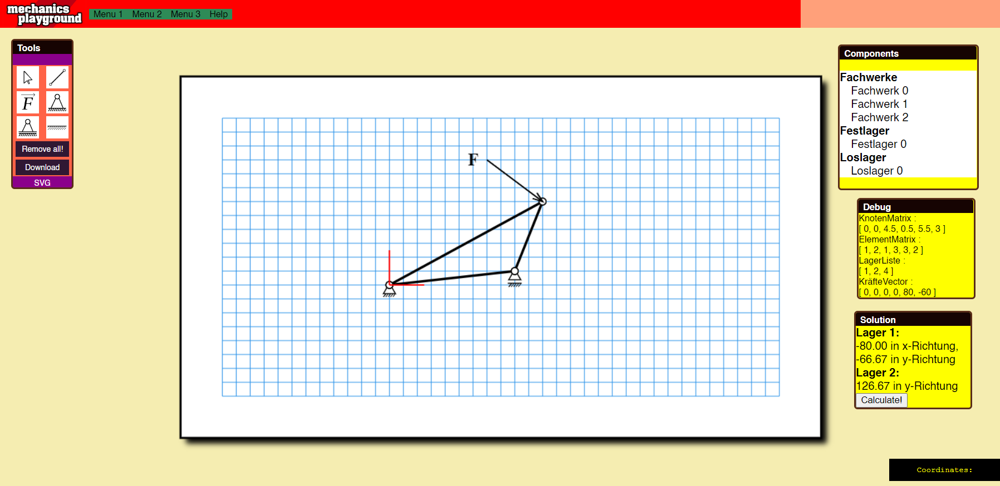

# Mechanics Simulator

Mechanics simulator to calculate forces in a truss system. Features a VueJS Frontend (using PaperJS for the graphics) and a WebAssembly Layer (with the help of [Emscripten](https://emscripten.org/) which handles the calculation of the trusses. The source code for the calculation is located under src/cpp/TruceCalc

## Project setup
```
npm install
```

### Compiles and hot-reloads for development
```
npm run serve
```

### Compiles and minifies for production
```
npm run build
```

### Lints and fixes files
```
npm run lint
```

## Screenshot
